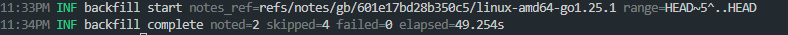
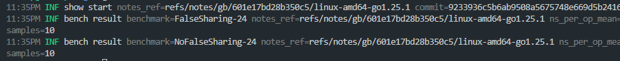
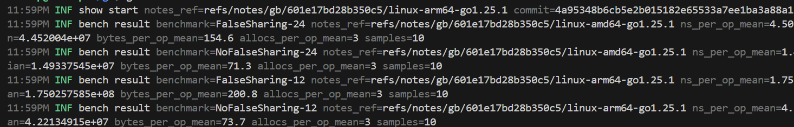
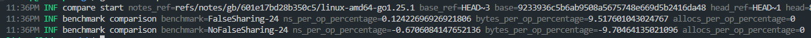
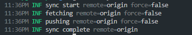
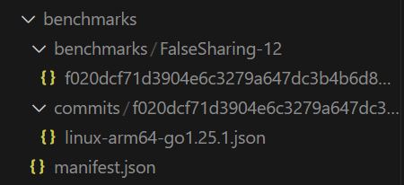
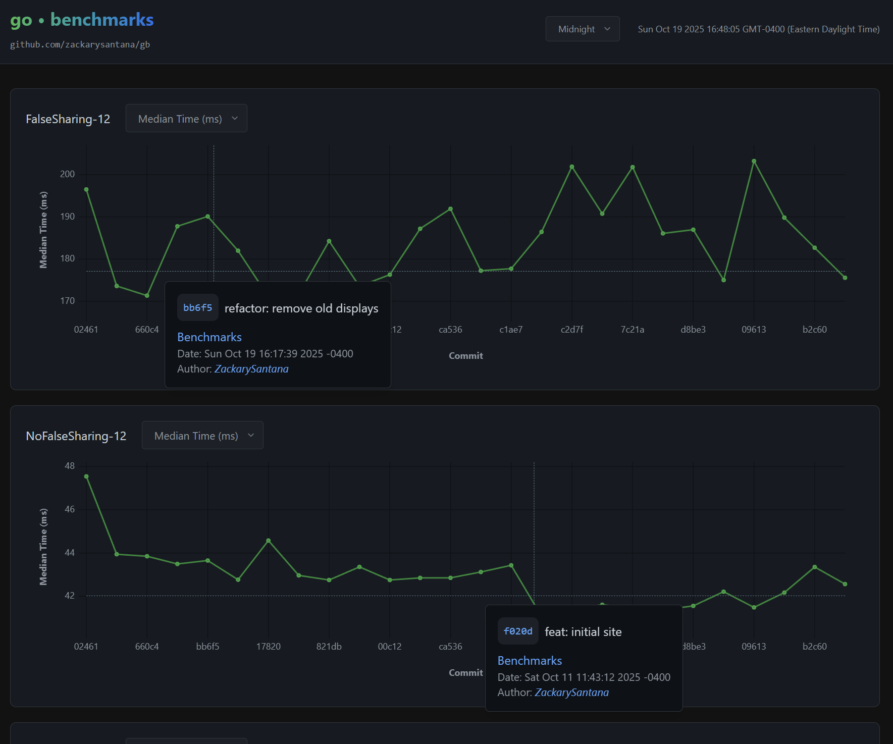

# Go Benchmark Notes Manager

[Demo](https://zackarysantana.github.io/gb/#/)

Do you want to easily track Go benchmark performance over time? Do you want a CLI tool that bundles a nice looking UI that displays graphs comparing benchmark results between commits? You want `gb`.

`gb` is a CLI tool that runs Go benchmarks, stores the notes in git notes, and provides commands to view and compare benchmark results over time.

At a high level, `gb` provides the following commands:

-   [backfill](#backfill): Run benchmarks for commits that do not have benchmark notes yet.
-   [show](#show): View benchmark notes for a specific commit.
-   [compare](#compare): Compare benchmark results between two commits.
-   [sync](#sync): Push and fetch benchmark notes to/from remote.
-   [export](#export): Export benchmark notes to a directory.
-   [display](#display): Display a static UI for comparing benchmark results (E.g. the [Demo](https://zackarysantana.github.io/gb/#/) site).
-   [help](#help): View help for `gb` commands.

## Installation

```bash
go install github.com/zackarysantana/gb
```

## GitHub Pages

One of the most elegant thing about `gb` is that the generated site is completely static. The [Demo](https://zackarysantana.github.io/gb/#/) site is hosted on GitHub Pages. To do something similar for your own repository, look inside [.github/workflows/benchmarks.yml](.github/workflows/benchmark.yml).

## Usage

### Backfill

Run benchmarks:

```bash
# Run benchmarks for last 6 commits (includes HEAD).
gb backfill HEAD~5
```



View benchmark notes for a specific commit:

### Show

```bash
gb show HEAD~3
```



View all benchmark notes for a specific commit (e.g. ones pushed from remote):

```bash
gb show HEAD~4 --all
```

(arm64 vs amd64 benchmarks shown below)


### Compare

Compare benchmarks between two commits:

```bash
gb compare HEAD~3 HEAD~1
# The default is HEAD~1 vs HEAD
gb compare
```



### Sync

Sync notes with remote:

```bash
gb sync
```



### Export

Export notes in to a directory

```bash
gb export HEAD~3
# For more options
gb export --help
```



### Display

Display a UI for comparing benchmarks:

```bash
gb display
```



(This looks for a ./benchmarks directory with exported benchmark notes)

## Manual

NAME:

-   gb - Go benchmark notes manager

USAGE:

-   gb [global options] [command [command options]]

COMMANDS:

-   backfill Backfill benchmark notes with missing commits since a ref
-   compare Compare stored notes for two refs
-   display Display benchmark notes via a UI
-   export Export benchmark notes to a file
-   show Show stored note for a commit/ref
-   sync Sync benchmark notes with remote (push/fetch)
-   help, h Shows a list of commands or help for one command

GLOBAL OPTIONS:

-   -v, --verbose (default: false)
-   --count int benchmark count (default: 10)
-   --benchtime string benchtime duration (e.g. 2s)
-   --bench string benchmark regex (default: ".")
-   --pkgs string comma-separated package list (default: "./...")
-   --notes-ref string override notes ref (will always be prefixed with refs/notes/gb/) (default: "601e17bd28b350c5/linux-arm64-go1.25.1")
-   --help, -h show help
